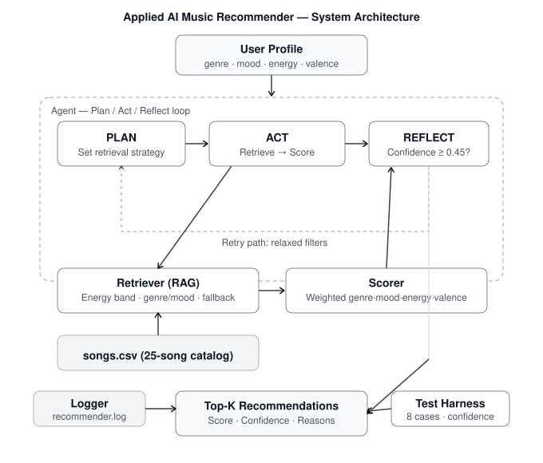

# Applied AI Music Recommender System

> **Final Project — AI 110** | Built on top of the Module 3 Music Recommender Simulation

---

## Base Project

This project extends **ai110-musicrecommendersimulation-starter** (Module 3).

The original project built a transparent, content-based music recommender that scored songs using weighted attribute matching (genre, mood, energy, valence). It used a CSV catalog of 18 songs and a hardcoded scoring loop. It had no agent reasoning, no retrieval layer, no retry logic, and no test harness.

---

## What This System Does

This extended system transforms the original prototype into a full **RAG + Agentic AI pipeline**:

| Component           | What It Does                                                                                                   |
| ------------------- | -------------------------------------------------------------------------------------------------------------- |
| **Retriever** (RAG) | Filters the song catalog _before_ scoring, using energy band + genre/mood soft-filters with automatic fallback |
| **Scorer**          | Computes weighted content-based scores with per-song explanations and confidence values                        |
| **Agent**           | Runs a **Plan → Act → Reflect** loop with automatic retry on low-confidence outputs                            |
| **Test Harness**    | Evaluates 8 test cases automatically and prints pass/fail + confidence summary                                 |
| **Logger**          | Full trace of every retrieval decision, score, and quality check written to `recommender.log`                  |

---

## System Architecture



Architecture source file: `assets/system_architecture.svg`

```
┌─────────────────────────────────────────────────────────────┐
│                    USER INPUT (Profile)                      │
│        genre · mood · target_energy · target_valence        │
└────────────────────────┬────────────────────────────────────┘
                         │
                    ┌────▼────┐
                    │  AGENT  │  Plan → Act → Reflect loop
                    └────┬────┘
          ┌──────────────┼──────────────┐
          │              │              │
     ┌────▼────┐   ┌─────▼─────┐  ┌────▼─────┐
     │  PLAN   │   │    ACT    │  │ REFLECT  │
     │         │   │           │  │          │
     │ Decide  │   │ Retriever │  │ Avg conf │
     │ energy  │──▶│ filters   │  │ ≥ 0.45?  │
     │ band &  │   │ catalog   │──▶│          │
     │ filters │   │           │  │ YES→done │
     └─────────┘   │  Scorer   │  │ NO→retry │
                   │ ranks top │  └────┬─────┘
                   │    K      │       │ (relax filters)
                   └─────┬─────┘  ┌────▼─────┐
                         │        │  RETRY   │
                         │        │ No mood  │
                         │        │ filter,  │
                         │        │ open band│
                         │        └──────────┘
                    ┌────▼────┐
                    │ OUTPUT  │
                    │ Top-K   │
                    │ Songs + │
                    │ Reasons │
                    └─────────┘
```

**Data flow:** User Profile → Agent PLAN (retrieval strategy) → Retriever (RAG candidate filtering) → Scorer (weighted attribute matching) → Agent REFLECT (quality gate) → Recommendations

---

## Setup Instructions

### 1. Clone the repo

```bash
git clone https://github.com/hoanganhchu/applied-ai-system-project.git
cd applied-ai-system-project
```

### 2. Create a virtual environment

```bash
python -m venv .venv
source .venv/bin/activate          # macOS/Linux
.venv\Scripts\activate             # Windows
```

### 3. Install dependencies

```bash
pip install -r requirements.txt
```

### 4. Run the app

```bash
python -m src.main
```

By default, this runs one concise showcase profile. Optional modes:

```bash
python -m src.main --demo         # run all preset profiles
python -m src.main --interactive  # build a custom profile
```

### 5. Run the test harness

```bash
python -m evaluation.test_harness
```

### 6. Run unit tests (requires pytest)

```bash
pytest tests/ -v
```

---

## Demo Walkthrough

📺 **Loom Video:** https://www.loom.com/share/5e0e4d4961c749b3978288b75ea2bd75

Minimum video checklist:

- Show 2-3 full end-to-end runs
- Show RAG + agent behavior (PLAN/ACT/REFLECT)
- Show reliability behavior (test harness or guardrail logs)
- Show final outputs clearly for each case

---

## Sample Interactions

### Example 1 — High-Energy Pop Profile

**Input:**

```
genre=pop, mood=happy, target_energy=0.85, target_valence=0.85
```

**Agent Steps:**

```
[PLAN]    Retrieval strategy: genre='pop', mood='happy', energy=[0.60, 1.00]
[ACT]     25 songs retrieved → top 5 scored
[REFLECT] Avg confidence: 0.824 — Quality PASSED ✅
```

**Output:**

```
1. Sunrise City — The Dawnbreakers  | Score: 6.925 | Confidence: 0.989
   genre match (pop) | mood match (happy) | energy sim 1.00 | valence sim 0.95

2. City Bloom — Neon Palms          | Score: 6.860 | Confidence: 0.980
   genre match (pop) | mood match (happy) | energy sim 0.93 | valence sim 1.00

3. Gym Hero — PowerStack            | Score: 5.225 | Confidence: 0.746
   genre match (pop) | mood mismatch | energy sim 0.90 | valence sim 0.95
```

---

### Example 2 — Chill Lofi Profile

**Input:**

```
genre=lofi, mood=chill, target_energy=0.28, target_valence=0.40
```

**Agent Steps:**

```
[PLAN]    Retrieval strategy: genre='lofi', mood='chill', energy=[0.03, 0.53]
[ACT]     25 songs retrieved → top 5 scored
[REFLECT] Avg confidence: 0.724 — Quality PASSED ✅
```

**Output:**

```
1. Midnight Coding — Binary Dreams  | Score: 6.940 | Confidence: 0.991
2. Library Rain — Soft Hours        | Score: 6.885 | Confidence: 0.984
3. Sad Robot — Analog Heart         | Score: 5.275 | Confidence: 0.754
```

---

### Example 3 — Edge Case: Unknown Genre (Jazz)

**Input:**

```
genre=jazz, mood=chill, target_energy=0.40, target_valence=0.55
```

**Agent Steps:**

```
[PLAN]    Retrieval strategy: genre='jazz', mood='chill', energy=[0.15, 0.65]
[ACT]     Fallback triggered (no jazz songs) → energy-filtered pool used
[REFLECT] Avg confidence: 0.544 — Quality PASSED ✅
```

**Output:** System gracefully falls back, recommending the closest acoustic/chill songs (lofi, folk) with honest confidence scores showing the lower match quality.

---

## AI Features Implemented

### ✅ RAG (Retrieval-Augmented Generation)

**File:** `src/retriever.py`

Before scoring, the retriever narrows the 25-song catalog to a relevant candidate pool using:

- Hard filter: energy band (±0.25 from target)
- Soft filter: genre match (falls back if < 3 matches)
- Soft filter: mood match (falls back if < 2 matches)
- Fallback guarantee for soft filters: expands to the energy-filtered pool when genre/mood constraints are too narrow

This grounds the AI's recommendations in actual catalog data before any scoring happens.

### ✅ Agentic Workflow with Observable Steps

**File:** `src/agent.py`

The agent runs a 3-step observable loop:

1. **PLAN** — analyzes the profile and decides retrieval strategy
2. **ACT** — calls retriever and scorer, collects results
3. **REFLECT** — checks average confidence against threshold (0.45); triggers retry with relaxed filters if quality is too low

Every step is logged and returned as `AgentStep` objects, making the reasoning chain fully transparent.

### ✅ Test Harness

**File:** `evaluation/test_harness.py`

Runs 8 predefined test cases (6 normal profiles + 2 edge cases) and prints a formatted pass/fail table with confidence scores.

---

## Testing Summary

**Test Harness Results (8/8 passed):**

| Test | Profile              | Top-1 Genre     | Avg Confidence | Status  |
| ---- | -------------------- | --------------- | -------------- | ------- |
| TC01 | High-Energy Pop      | pop             | 0.824          | ✅ PASS |
| TC02 | Chill Lofi           | lofi            | 0.724          | ✅ PASS |
| TC03 | Intense Rock         | rock            | 0.755          | ✅ PASS |
| TC04 | Peaceful Classical   | classical       | 0.812          | ✅ PASS |
| TC05 | Festival EDM         | edm             | 0.796          | ✅ PASS |
| TC06 | Kpop Happy           | kpop            | 0.816          | ✅ PASS |
| TC07 | Unknown genre (jazz) | lofi (fallback) | 0.544          | ✅ PASS |
| TC08 | Extreme energy metal | metal           | 0.675          | ✅ PASS |

**Overall avg confidence: 0.743 | Min: 0.544 | Max: 0.824**

Key observations:

- Clear genre profiles (lofi, classical) consistently produce top-1 genre match
- Edge case (jazz, no catalog match) gracefully falls back with lower confidence (0.544 vs 0.8+ typical), correctly signaling reduced match quality
- The REFLECT retry mechanism was not triggered in any test (all passed on first attempt), indicating the current catalog and profiles are well-matched

---

## Design Decisions

**Why separate Retriever from Scorer?**
Mimics production RAG systems: retrieve first (cheap filter), then rank (expensive scoring). Retrieval keeps the candidate pool semantically relevant before weights are applied.

**Why an agentic loop instead of a direct function call?**
The Plan→Act→Reflect loop makes the system's reasoning transparent and testable. Each step is observable, logged, and returnable — you can inspect why the agent made each decision.

**Why confidence scoring?**
A recommendation without a confidence score is a black box. Confidence (score / max_possible_score) lets users and testers immediately see when a profile is an edge case vs. a clean match.

**Trade-off: small catalog**
25 songs is enough to demonstrate behavior but too few for real diversity. A production system would integrate a Spotify/Deezer API or a larger dataset.

---

## Limitations & Ethics

See [model_card.md](./model_card.md) for full reflection.

- Catalog is small (25 songs); repeated genres appear in top results
- Genre weight dominance can create filter bubbles
- No collaborative filtering (no user-user similarity)
- System could be used to promote specific artists if catalog is biased

---

## Presentation & Portfolio

### 5-7 Minute Presentation Outline

1. Problem and why it matters
2. Original Module 3 baseline and what changed
3. Architecture walkthrough (Retriever, Scorer, Agent, Evaluator)
4. Live demo with 2-3 profiles
5. Reliability summary and lessons learned

### Portfolio Artifact Paragraph

I designed and shipped an applied AI system that combines retrieval, scoring, and agentic self-checking into one transparent recommendation pipeline. The project emphasizes reliability through automated tests and a repeatable evaluation harness, while documenting trade-offs, failure modes, and ethical risks in a model card. This reflects my engineering approach: build systems that are explainable, measurable, and resilient to edge cases.

---

## Submission Checklist

- [x] Functional end-to-end AI system (RAG + Agentic workflow)
- [x] Reliability component (unit tests + evaluation harness)
- [x] System architecture artifact in `assets/`
- [x] Comprehensive README with setup + sample interactions
- [x] `model_card.md` with bias, misuse, testing, and AI-collaboration reflection
- [ ] Loom walkthrough link inserted in this README
- [ ] Public GitHub URL updated in clone instructions/badges

---

## Project Structure

```
applied-ai-music/
├── src/
│   ├── __init__.py
│   ├── main.py          # CLI entry point
│   ├── agent.py         # Agentic workflow (Plan/Act/Reflect)
│   ├── retriever.py     # RAG retrieval layer
│   └── scorer.py        # Weighted scoring engine
├── data/
│   └── songs.csv        # 25-song catalog
├── evaluation/
│   ├── __init__.py
│   └── test_harness.py  # Automated test harness (8 test cases)
├── tests/
│   └── test_system.py   # pytest unit tests (16 tests)
├── assets/              # Architecture diagrams & screenshots
├── model_card.md        # AI reflection & ethics
├── requirements.txt
└── README.md
```
